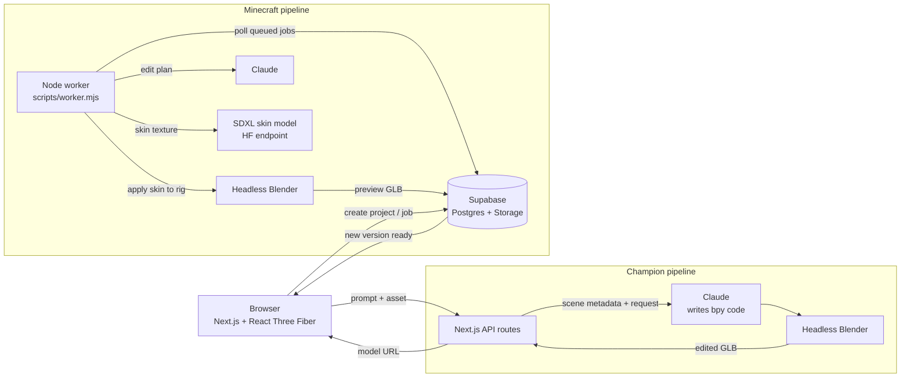

<div align="center">

# CH4NG3D

**An AI game-asset studio. Describe a change in plain English and it rebuilds the 3D character for you.**

Claude plans the edit, a diffusion model paints the textures, and headless Blender does the 3D work.
The result shows up in a live Three.js viewport.


</div>

---

## What it does

CH4NG3D has two studios that share one idea: **natural language in, a modified rigged 3D model out.**

### 🟩 Minecraft Skin Studio
- Upload a skin (PNG/JPG/WebP) or a GLB/GLTF model.
- Type something like *"make him a cyberpunk samurai with a glowing visor"*.
- Claude turns the prompt into a structured **edit plan**. A fine-tuned **SDXL Minecraft skin model** generates the texture.
- Deterministic post-processing fixes palette, symmetry and eye placement, then crops the atlas to 64×64.
- Headless **Blender** applies the skin to a rigged player model and exports a GLB preview.
- Every edit is saved as a **version**, so you can branch and roll back.

### 🟧 Champion Editor (agentic Blender)
- Load a rigged champion model into the viewer.
- Ask for any transformation, like *"mecha armor"*, *"demon wings"* or *"anime recolor"*.
- Claude acts as a **technical artist agent**. It writes Blender Python (`bpy`) against the model's real mesh, material and bone layout.
- The generated script runs in headless Blender. The edited GLB comes back to the viewer with its skinning and animation intact.
- Edit history is cached, so you can flip between earlier results.

---

## Architecture



**Job lifecycle (Minecraft):** `queued → planning → generating_texture → running_blender → validating → completed`

The web app polls the project and swaps the viewport model as soon as a new version lands.

---

## Tech stack

| Layer | Tools |
|---|---|
| Frontend | Next.js 16 (App Router), React 19, Tailwind CSS 4, lucide-react |
| 3D viewing | Three.js, @react-three/fiber, @react-three/drei |
| AI | Claude (Anthropic SDK) for planning and code generation, Monadical SDXL Minecraft skin generator, GPT-Image as a legacy fallback |
| 3D processing | Blender (headless, Python `bpy`), `sharp` for image post-processing |
| Backend | Supabase (Postgres for projects/versions/jobs, Storage for assets) |

---

## Getting started

### Prerequisites
- **Node.js 20+**
- **Blender 4.3+**, either on your `PATH` or set with `BLENDER_PATH`
- A **Supabase** project (free tier is fine)
- An **Anthropic API key**
- *(Optional)* A Hugging Face / Colab endpoint running the Minecraft SDXL skin model

### 1. Install

```bash
git clone https://github.com/Latifmudashiru/Ch3ngeD.git
cd Ch3ngeD
npm install
```

### 2. Configure environment

```bash
cp .env.local.example .env.local
```

Then fill in `.env.local`:

| Variable | Required | Purpose |
|---|---|---|
| `NEXT_PUBLIC_SUPABASE_URL` | ✅ | Your Supabase project URL |
| `NEXT_PUBLIC_SUPABASE_PUBLISHABLE_KEY` | ✅ | Supabase publishable (anon) key |
| `SUPABASE_SERVICE_ROLE_KEY` | ➖ | Worker only. Never expose it to the browser |
| `ANTHROPIC_API_KEY` | ✅ | Claude planning and bpy code generation |
| `ANTHROPIC_MODEL` | ➖ | Override the Claude model |
| `BLENDER_PATH` | ➖ | Path to `blender`/`blender.exe` if it isn't on `PATH` |
| `HF_ENDPOINT_URL` / `HF_TOKEN` | ➖ | SDXL Minecraft skin generator endpoint |
| `OPENAI_API_KEY` | ➖ | Legacy GPT-Image fallback |
| `MINECRAFT_RIG_PATH` | ➖ | Path to your rigged Minecraft player `.blend` |

> `.env.local` is gitignored. Never commit real keys.

### 3. Set up Supabase

Create these resources in your project:

- **Tables:** `asset_projects`, `asset_versions`, `asset_jobs` (fields match the types in [`src/lib/types.ts`](src/lib/types.ts))
- **Storage buckets:** `asset-sources`, `asset-previews`

Turn on Row Level Security with policies that fit your use.

### 4. Bring your own 3D assets

Third-party and proprietary models are **not** in this repo:

- **Minecraft rig:** use any rigged Minecraft player `.blend` file and point `MINECRAFT_RIG_PATH` at it.
- **Champion model:** put a rigged `.glb` in `public/models/lol/`. See [that folder's README](public/models/lol/README.md).

### 5. Run it

```bash
# Terminal 1: web app
npm run dev

# Terminal 2: Blender worker (Minecraft pipeline)
npm run worker
```

Open http://localhost:3000 and pick a studio.

---

## Project structure

```
Ch3ngeD/
├── src/
│   ├── app/
│   │   ├── page.tsx                 # Studio picker
│   │   ├── minecraft/               # Minecraft skin studio
│   │   ├── lol/                     # Champion editor
│   │   └── api/lol/{edit,history}/  # Agentic Blender edit + history endpoints
│   ├── components/
│   │   ├── studio-shell.tsx         # Minecraft studio UI (upload, chat, versions)
│   │   ├── lol-studio.tsx           # Champion editor UI
│   │   ├── model-viewer.tsx         # React Three Fiber GLB viewer
│   │   └── cube-3d.tsx
│   └── lib/
│       ├── agentic-3d-engine.ts     # Claude → bpy code generation + scene metadata
│       ├── supabase.ts
│       └── types.ts
└── scripts/
    ├── worker.mjs                   # Job queue worker: Claude → SDXL → Blender
    ├── blender_transform.py         # Blender-side skin application + GLB export
    ├── agentic_3d_engine.mjs        # Node version of the agentic engine
    └── ...                          # Inspection / pipeline test helpers
```

---

## Roadmap

- [ ] Stronger UV validation for generated skins
- [ ] Richer accessory library (hats, capes, held items)
- [ ] Safer, schema-validated operation set in place of free-form `bpy`
- [ ] Automated rig validation
- [ ] More supported games

---

## Disclaimer

This is a personal/educational project. It is **not affiliated with, endorsed by, or sponsored by** Mojang Studios, Microsoft, or Riot Games.
*Minecraft* and *League of Legends* are trademarks of their respective owners. No copyrighted game assets are distributed in this repository.

## License

[MIT](LICENSE) © Latif Mudashiru
